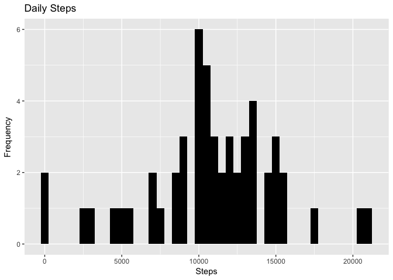
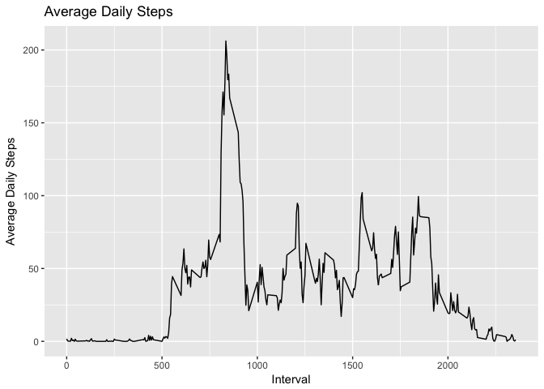
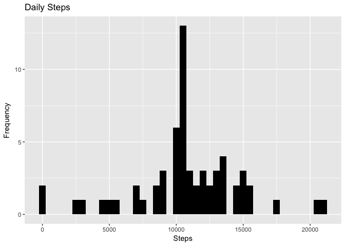
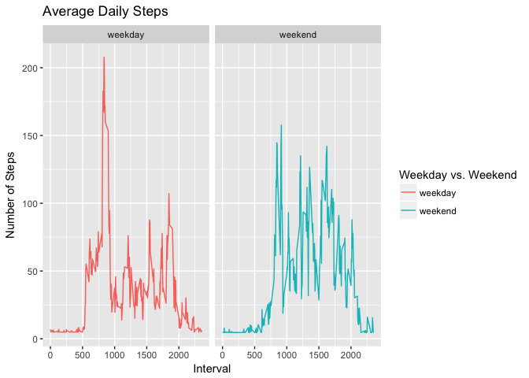

## Load and Preprocess Data

```r
library("data.table")
library(ggplot2)

# unzip data (already present in the folder)
unzip(zipfile = "activity.zip")

# read data
activity_data <- fread(input = "activity.csv")
```

## 1. What is the mean total number of steps taken per day? Ignore NAs.
### 1.1. Calculate the total number of steps taken per day.

```r
daily_steps <- activity_data[, c(lapply(.SD, sum, na.rm = FALSE)), .SDcols = c("steps"), by = .(date)]
head(daily_steps)
```

```
##          date steps
## 1: 2012-10-01    NA
## 2: 2012-10-02   126
## 3: 2012-10-03 11352
## 4: 2012-10-04 12116
## 5: 2012-10-05 13294
## 6: 2012-10-06 15420
```

### 1.2. If you do not understand the difference between a histogram and a barplot, research the difference between them. Make a histogram of the total number of steps taken each day.

```r
ggplot(daily_steps, aes(x = steps)) +
    geom_histogram(fill = "black", binwidth = 500) +
    labs(title = "Daily Steps", x = "Steps", y = "Frequency")
```

```
## Warning: Removed 8 rows containing non-finite values (stat_bin).
```

<!-- -->

### 1.3. Calculate and report the mean and median of the total number of steps taken per day.

```r
daily_steps[, .(steps_median = median(steps, na.rm = TRUE), steps_mean = mean(steps, na.rm = TRUE))]
```

```
##    steps_median steps_mean
## 1:        10765   10766.19
```

## 2. What is the average daily activity pattern?
### 2.1. Make a time series plot of the 5-minute interval (x-axis) and the average number of steps taken, averaged across all days (y-axis).

```r
interval_data <- activity_data[, c(lapply(.SD, mean, na.rm = TRUE)), .SDcols = c("steps"), by = .(interval)]
ggplot(interval_data, aes(x = interval , y = steps)) + 
    geom_line(color="black", size = 0.5) + 
    labs(title = "Average Daily Steps", x = "Interval", y = "Average Daily Steps")
```

<!-- -->

### 2.2. Which 5-minute interval, on average across all the days in the dataset, contains the maximum number of steps?

```r
interval_data[steps == max(steps), .(IntervalWithMaxSteps = interval)]
```

```
##    IntervalWithMaxSteps
## 1:                  835
```

## 3. Imputing missing values.
### 3.1. Calculate and report the total number of missing values in the dataset (i.e. the total number of rows with NAs).

```r
nrow(activity_data[is.na(steps),])
```

```
## [1] 2304
```

### 3.2. Devise a strategy for filling in all of the missing values in the dataset. The strategy does not need to be sophisticated. For example, you could use the mean/median for that day, or the mean for that 5-minute interval, etc.

```r
# Fill missing values with the mean of the dataset.
activity_data[is.na(steps), "steps"] <- activity_data[, c(lapply(.SD, mean, na.rm = TRUE)), .SDcols = c("steps")]
```

```
## Warning in `[<-.data.table`(`*tmp*`, is.na(steps), "steps", value =
## structure(list(: Coerced 'double' RHS to 'integer' to match the column's
## type; may have truncated precision. Either change the target column
## ['steps'] to 'double' first (by creating a new 'double' vector length 17568
## (nrows of entire table) and assign that; i.e. 'replace' column), or coerce
## RHS to 'integer' (e.g. 1L, NA_[real|integer]_, as.*, etc) to make your
## intent clear and for speed. Or, set the column type correctly up front when
## you create the table and stick to it, please.
```

### 3.3. Create a new dataset that is equal to the original dataset but with the missing data filled in.

```r
fwrite(x = activity_data, file = "clean_data.csv", quote = FALSE)
```

### 3.4. Make a histogram of the total number of steps taken each day and calculate and report the mean and median total number of steps taken per day. Do these values differ from the estimates from the first part of the assignment? What is the impact of imputing missing data on the estimates of the total daily number of steps?

```r
# total daily steps
total_steps <- activity_data[, c(lapply(.SD, sum)), .SDcols = c("steps"), by = .(date)] 
# mean and median total number of steps taken per day
total_steps[, .(mean_steps = mean(steps), median_steps = median(steps))]
```

```
##    mean_steps median_steps
## 1:   10751.74        10656
```

```r
ggplot(total_steps, aes(x = steps)) + 
    geom_histogram(fill = "black", binwidth = 500) + 
    labs(title = "Daily Steps", x = "Steps", y = "Frequency")
```

<!-- -->


Part 1 (with NAs): mean steps = 10766.19, median steps = 10765

Part 2 (NAs replaced by mean): mean steps = 10751.74, median steps = 10656

## 4. Are there differences in activity patterns between the weekdays and weekends?
### 4.1. Create a new factor variable in the dataset with two levels – “weekday” and “weekend” indicating whether a given date is a weekday or weekend day

```r
activity_data <- fread(input = "activity.csv")
activity_data[, date := as.POSIXct(date, format = "%Y-%m-%d")]
activity_data[, "Day" := weekdays(x = date)]
activity_data[grepl(pattern = "Saturday|Sunday", x = `Day`), "Weekday vs. Weekend"] <- "weekend"
activity_data[grepl(pattern = "Monday|Tuesday|Wednesday|Thursday|Friday", x = `Day`), "Weekday vs. Weekend"] <- "weekday"
activity_data[, `Weekday vs. Weekend` := as.factor(`Weekday vs. Weekend`)]
head(activity_data)
```

```
##    steps       date interval    Day Weekday vs. Weekend
## 1:    NA 2012-10-01        0 Monday             weekday
## 2:    NA 2012-10-01        5 Monday             weekday
## 3:    NA 2012-10-01       10 Monday             weekday
## 4:    NA 2012-10-01       15 Monday             weekday
## 5:    NA 2012-10-01       20 Monday             weekday
## 6:    NA 2012-10-01       25 Monday             weekday
```

### 4.2. Make a panel plot containing a time series plot of the 5-minute interval (x-axis) and the average number of steps taken, averaged across all weekday days or weekend days (y-axis).

```r
activity_data[is.na(steps), "steps"] <- activity_data[, c(lapply(.SD, mean, na.rm = TRUE)), .SDcols = c("steps")]
```

```
## Warning in `[<-.data.table`(`*tmp*`, is.na(steps), "steps", value =
## structure(list(: Coerced 'double' RHS to 'integer' to match the column's
## type; may have truncated precision. Either change the target column
## ['steps'] to 'double' first (by creating a new 'double' vector length 17568
## (nrows of entire table) and assign that; i.e. 'replace' column), or coerce
## RHS to 'integer' (e.g. 1L, NA_[real|integer]_, as.*, etc) to make your
## intent clear and for speed. Or, set the column type correctly up front when
## you create the table and stick to it, please.
```

```r
interval_data_2 <- activity_data[, c(lapply(.SD, mean, na.rm = TRUE)), .SDcols = c("steps"), by = .(interval, `Weekday vs. Weekend`)]

ggplot(interval_data_2 , aes(x = interval , y = steps, color = `Weekday vs. Weekend`)) + geom_line() + 
    labs(title = "Average Daily Steps", x = "Interval", y = "Number of Steps") +
    facet_wrap(~`Weekday vs. Weekend` , ncol = 2, nrow = 1)
```

<!-- -->

